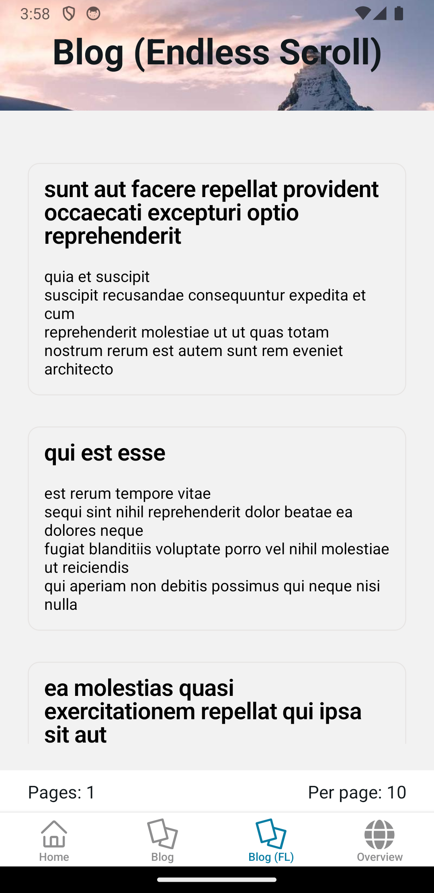
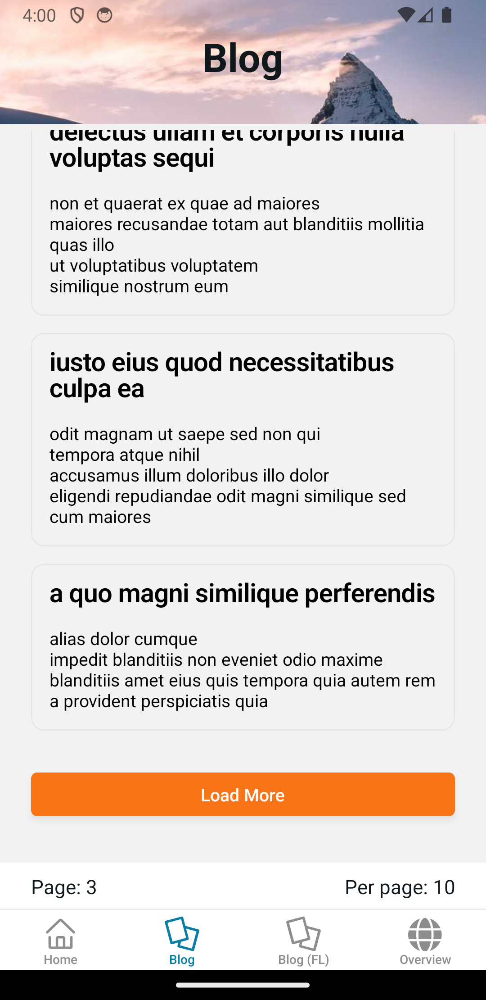

# Welcome to your Expo app 👋

This is an [Expo](https://expo.dev) project created with [`create-expo-app`](https://www.npmjs.com/package/create-expo-app).

### Features
- Expo SDK 52
- React Native New App Architecture 
- React-Query for amazing UX/DX with APIs
- Notifications (via expo-notifications) + Deep-Linking
- Theming by ShadCn-UI CSS variables
- Sample Screens
   - Blog - posts loaded via useQuery and a *pagination* component
   - Blog Endless-Scroll - posts loaded via useInfiniteQuery
   - Notifications - Send local notifications on device

Blog Endless Scroll Mode using Flatlist             |  Blog manual pagination
:-------------------------:|:-------------------------:
  |   


## Get started

1. Install dependencies

   ```bash
   npm install
   ```

2. Start the app

   ```bash
    npx expo start
   ```

In the output, you'll find options to open the app in a

- [development build](https://docs.expo.dev/develop/development-builds/introduction/)
- [Android emulator](https://docs.expo.dev/workflow/android-studio-emulator/)
- [iOS simulator](https://docs.expo.dev/workflow/ios-simulator/)
- [Expo Go](https://expo.dev/go), a limited sandbox for trying out app development with Expo

You can start developing by editing the files inside the **app** directory. This project uses [file-based routing](https://docs.expo.dev/router/introduction).

## Get a fresh project

When you're ready, run:

```bash
npm run reset-project
```

This command will move the starter code to the **app-example** directory and create a blank **app** directory where you can start developing.

## Learn more

To learn more about developing your project with Expo, look at the following resources:

- [Expo documentation](https://docs.expo.dev/): Learn fundamentals, or go into advanced topics with our [guides](https://docs.expo.dev/guides).
- [Learn Expo tutorial](https://docs.expo.dev/tutorial/introduction/): Follow a step-by-step tutorial where you'll create a project that runs on Android, iOS, and the web.

## Join the community

Join our community of developers creating universal apps.

- [Expo on GitHub](https://github.com/expo/expo): View our open source platform and contribute.
- [Discord community](https://chat.expo.dev): Chat with Expo users and ask questions.

## EAS
Common commands to build with EAS. [Click Here](https://docs.expo.dev/build/setup/) for the latest build steps.

>NB: For fresh projects without an existing Android Keystore, it is recommended to first run `eas build --platform android` so as to register a new key with EAS.

```bash
# Configure
eas build:configure

# Build
eas build --platform android
eas build --platform ios
eas build --platform all

eas build --platform android --profile preview
eas build --platform android --profile development

# List builds
eas build:list
```
